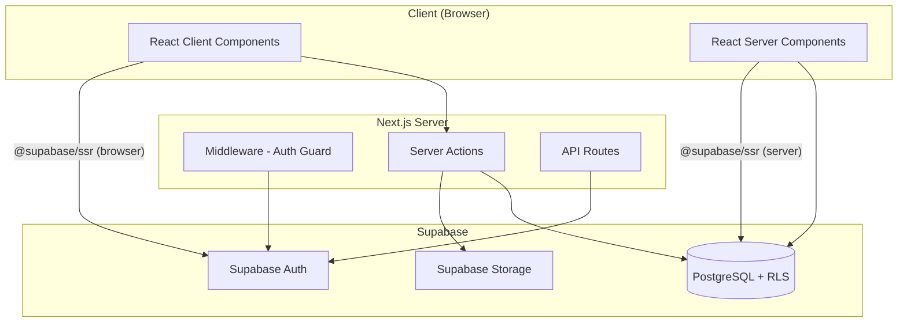

# Design Document: PharmaRep CRM

## Overview

PharmaRep CRM is a full-stack web application for pharmaceutical representatives built with Next.js 14 (App Router), TypeScript, Tailwind CSS, and Supabase. The system enables representatives to manage their HCP portfolio, schedule/record visits, control sample inventory, track relationship pipeline, and visualize performance metrics.

The architecture follows a server-first approach using React Server Components for data fetching and Client Components only where interactivity is required. Supabase provides PostgreSQL with Row Level Security for data isolation, authentication via email/password, and file storage for avatars.

### Key Design Decisions

1. **Server Components by default** — Data fetching happens on the server, reducing client bundle size and improving initial load time
2. **Tablet-first responsive design** — Layout optimized for 768px-1024px viewports as the primary use case
3. **Bottom Sheet over Modal** — On tablet/mobile, detail views and forms use Bottom Sheet for ergonomic touch interaction
4. **No drag & drop in MVP** — Kanban uses arrow buttons for stage transitions (more reliable on touch devices)
5. **Optimistic UI** — Pipeline moves and visit completions update the UI immediately before server confirmation
6. **Server-side pagination** — All lists paginate at 20 items with "Load more" pattern to avoid client overload

## Architecture



### Request Flow

1. **Initial page load**: Next.js middleware checks session via `@supabase/ssr` server client → redirects if unauthenticated
2. **Server Component render**: Fetches data directly from Supabase using server client with cookies
3. **Client interactions**: Client Components use browser Supabase client for mutations, then revalidate server data via `revalidatePath`
4. **Auth flow**: Login/register use Supabase Auth client methods → middleware handles session cookie management

### Route Structure

```
app/
├── (auth)/          # Public routes: login, register
│   ├── login/
│   └── register/
├── (dashboard)/     # Protected routes (middleware-guarded)
│   ├── layout.tsx   # Sidebar + Header + BottomNav
│   ├── page.tsx     # Dashboard (metrics)
│   ├── hcps/       # HCP management
│   ├── visits/     # Visit scheduling
│   ├── pipeline/   # Kanban board
│   ├── inventory/  # Sample stock
│   └── settings/   # Account settings
├── layout.tsx       # Root layout (html, body, globals)
└── globals.css      # Tailwind directives + custom tokens
```

## Components and Interfaces

### Layout Components

```typescript
// components/layout/Sidebar.tsx
interface SidebarProps {
  currentPath: string;
  user: { full_name: string; avatar_url: string | null; email: string };
}
// Desktop: 240px fixed, icons + labels
// Tablet: 64px collapsed, icons only, hover expands
// Mobile: hidden (BottomNav used instead)

// components/layout/BottomNav.tsx
interface BottomNavProps {
  currentPath: string;
}
// 5 navigation items: Dashboard, HCPs, Visits, Pipeline, More
// Fixed at bottom, 64px height, visible only on mobile (<768px)

// components/layout/Header.tsx
interface HeaderProps {
  title: string;
  user: { full_name: string; avatar_url: string | null };
}
// 56px height, page title + user avatar dropdown
```

### UI Component Library

```typescript
// components/ui/Button.tsx
interface ButtonProps extends React.ButtonHTMLAttributes<HTMLButtonElement> {
  variant: 'primary' | 'secondary' | 'danger' | 'ghost';
  size?: 'sm' | 'md' | 'lg';
  loading?: boolean;
  children: React.ReactNode;
}

// components/ui/Input.tsx
interface InputProps extends React.InputHTMLAttributes<HTMLInputElement> {
  label: string;
  error?: string;
  icon?: React.ReactNode;
}

// components/ui/Select.tsx
interface SelectProps extends React.SelectHTMLAttributes<HTMLSelectElement> {
  label: string;
  error?: string;
  options: { value: string; label: string }[];
}

// components/ui/Badge.tsx
interface BadgeProps {
  variant: 'success' | 'warning' | 'danger' | 'info' | 'neutral';
  children: React.ReactNode;
}

// components/ui/Card.tsx
interface CardProps {
  children: React.ReactNode;
  hoverable?: boolean;
  className?: string;
}

// components/ui/Modal.tsx
interface ModalProps {
  open: boolean;
  onClose: () => void;
  title: string;
  size?: 'sm' | 'md' | 'lg';
  children: React.ReactNode;
}

// components/ui/BottomSheet.tsx
interface BottomSheetProps {
  open: boolean;
  onClose: () => void;
  title: string;
  children: React.ReactNode;
}

// components/ui/Toast.tsx
interface ToastProps {
  type: 'success' | 'error' | 'warning';
  message: string;
  duration?: number; // default 3000ms
}
```

### Feature Components

```typescript
// components/hcps/HcpCard.tsx
interface HcpCardProps {
  hcp: HCP;
  onView: (id: string) => void;
}

// components/hcps/HcpForm.tsx
interface HcpFormProps {
  defaultValues?: Partial<HCP>;
  onSubmit: (data: HCPFormData) => Promise<void>;
  loading?: boolean;
}

// components/visits/VisitCard.tsx
interface VisitCardProps {
  visit: Visit & { hcp: Pick<HCP, 'name' | 'specialty'> };
  onRegisterResult: (id: string) => void;
}

// components/visits/VisitForm.tsx
interface VisitFormProps {
  preselectedHcp?: Pick<HCP, 'id' | 'name'>;
  onSubmit: (data: VisitFormData) => Promise<void>;
}

// components/visits/VisitResult.tsx
interface VisitResultProps {
  visitId: string;
  products: Product[];
  onSubmit: (data: VisitResultData) => Promise<void>;
}

// components/pipeline/KanbanBoard.tsx
interface KanbanBoardProps {
  deals: PipelineDeal[];
  onMoveForward: (dealId: string) => void;
  onMoveBackward: (dealId: string) => void;
  onCreateDeal: (data: NewDealData) => void;
}

// components/inventory/StockTable.tsx
interface StockTableProps {
  items: InventoryItem[];
  onAddStock: (productId: string, quantity: number) => void;
  onEditMinimum: (productId: string, min: number) => void;
}
```

### Hooks

```typescript
// hooks/useHcps.ts
function useHcps(filters?: HcpFilters): {
  hcps: HCP[];
  loading: boolean;
  error: string | null;
  loadMore: () => void;
  hasMore: boolean;
}

// hooks/useVisits.ts
function useVisits(filters?: VisitFilters): {
  visits: Visit[];
  loading: boolean;
  error: string | null;
}

// hooks/useInventory.ts
function useInventory(): {
  items: InventoryItem[];
  loading: boolean;
  addStock: (productId: string, qty: number) => Promise<void>;
  deductStock: (productId: string, qty: number) => Promise<void>;
}

// hooks/useUser.ts
function useUser(): {
  user: UserProfile | null;
  loading: boolean;
  updateProfile: (data: Partial<UserProfile>) => Promise<void>;
}
```

## Data Models

### TypeScript Types

```typescript
// types/index.ts

export interface UserProfile {
  id: string;
  full_name: string;
  email: string;
  avatar_url: string | null;
  company: string | null;
  region: string | null;
  created_at: string;
  updated_at: string;
}

export interface HCP {
  id: string;
  user_id: string;
  name: string;
  crm: string;
  cpf: string | null;
  email: string | null;
  mobile_phone: string | null;
  landline_phone: string | null;
  specialty: string;
  category: string | null;
  potential: 1 | 2 | 3 | null;
  adoption_curve: 'Inovador' | 'Early Adopter' | 'Maioria Inicial' | 'Maioria Tardia' | 'Retardatário' | null;
  clinic_name: string | null;
  clinic_address: string | null;
  clinic_city: string | null;
  clinic_state: string | null;
  clinic_zip: string | null;
  notes: string | null;
  active: boolean;
  created_at: string;
  updated_at: string;
}

export interface Product {
  id: string;
  user_id: string;
  name: string;
  description: string | null;
  category: string | null;
  active: boolean;
  created_at: string;
}

export interface Visit {
  id: string;
  user_id: string;
  hcp_id: string;
  scheduled_at: string;
  completed_at: string | null;
  status: 'scheduled' | 'completed' | 'cancelled' | 'rescheduled';
  rating: 'great' | 'good' | 'neutral' | 'bad' | null;
  notes: string | null;
  duration_minutes: number | null;
  location: string | null;
  created_at: string;
  updated_at: string;
}

export interface VisitProduct {
  id: string;
  visit_id: string;
  product_id: string;
  samples_delivered: number;
  notes: string | null;
}

export interface InventoryItem {
  id: string;
  user_id: string;
  product_id: string;
  quantity: number;
  unit: string;
  min_quantity: number;
  updated_at: string;
  product?: Product; // joined
}

export interface PipelineDeal {
  id: string;
  user_id: string;
  hcp_id: string;
  title: string;
  stage: 'prospeccao' | 'primeiro_contato' | 'visita_agendada' | 'em_relacionamento' | 'convertido' | 'perdido';
  priority: 'low' | 'medium' | 'high';
  notes: string | null;
  expected_close: string | null;
  created_at: string;
  updated_at: string;
  hcp?: Pick<HCP, 'name' | 'specialty'>; // joined
}
```

### Database Schema (Supabase PostgreSQL)

7 tables with RLS enabled on all:

| Table | Key Columns | RLS Policy |
|-------|-------------|------------|
| profiles | id (FK auth.users), full_name, email, company, region | `auth.uid() = id` |
| hcps | id, user_id, name, crm, specialty, potential, adoption_curve, active | `auth.uid() = user_id` |
| products | id, user_id, name, category, active | `auth.uid() = user_id` |
| visits | id, user_id, hcp_id, scheduled_at, status, rating | `auth.uid() = user_id` |
| visit_products | id, visit_id, product_id, samples_delivered | `EXISTS (SELECT 1 FROM visits WHERE visits.id = visit_products.visit_id AND visits.user_id = auth.uid())` |
| inventory | id, user_id, product_id, quantity, min_quantity | `auth.uid() = user_id` |
| pipeline_deals | id, user_id, hcp_id, title, stage, priority | `auth.uid() = user_id` |

### Supabase Client Configuration

```typescript
// lib/supabase/client.ts — Browser client (Client Components)
import { createBrowserClient } from '@supabase/ssr';

export function createClient() {
  return createBrowserClient(
    process.env.NEXT_PUBLIC_SUPABASE_URL!,
    process.env.NEXT_PUBLIC_SUPABASE_ANON_KEY!
  );
}

// lib/supabase/server.ts — Server client (Server Components, Server Actions)
import { createServerClient } from '@supabase/ssr';
import { cookies } from 'next/headers';

export async function createClient() {
  const cookieStore = await cookies();
  return createServerClient(
    process.env.NEXT_PUBLIC_SUPABASE_URL!,
    process.env.NEXT_PUBLIC_SUPABASE_ANON_KEY!,
    {
      cookies: {
        getAll() { return cookieStore.getAll(); },
        setAll(cookiesToSet) {
          cookiesToSet.forEach(({ name, value, options }) => {
            cookieStore.set(name, value, options);
          });
        },
      },
    }
  );
}
```

### Validation Schemas (Zod)

```typescript
// lib/validations/hcp.ts
import { z } from 'zod';

export const hcpSchema = z.object({
  name: z.string().min(1, 'Nome é obrigatório'),
  crm: z.string().min(1, 'CRM é obrigatório'),
  cpf: z.string().regex(/^\d{11}$/, 'CPF deve ter 11 dígitos').optional().or(z.literal('')),
  email: z.string().email('Email inválido').optional().or(z.literal('')),
  mobile_phone: z.string().min(1, 'Celular é obrigatório'),
  landline_phone: z.string().optional(),
  specialty: z.string().min(1, 'Especialidade é obrigatória'),
  category: z.string().optional(),
  potential: z.enum(['1', '2', '3']).optional(),
  adoption_curve: z.enum(['Inovador', 'Early Adopter', 'Maioria Inicial', 'Maioria Tardia', 'Retardatário']).optional(),
  clinic_name: z.string().optional(),
  clinic_address: z.string().optional(),
  clinic_city: z.string().optional(),
  clinic_state: z.string().optional(),
  clinic_zip: z.string().optional(),
  notes: z.string().optional(),
});

// lib/validations/visit.ts
import { z } from 'zod';

export const visitSchema = z.object({
  hcp_id: z.string().uuid('Selecione um médico'),
  scheduled_at: z.string().min(1, 'Data é obrigatória'),
  location: z.string().optional(),
  notes: z.string().optional(),
});

export const visitResultSchema = z.object({
  status: z.enum(['completed', 'cancelled', 'rescheduled']),
  rating: z.enum(['great', 'good', 'neutral', 'bad']).optional(),
  notes: z.string().optional(),
  products: z.array(z.object({
    product_id: z.string().uuid(),
    samples_delivered: z.number().min(0),
  })).optional(),
});
```

## Correctness Properties

*A property is a characteristic or behavior that should hold true across all valid executions of a system — essentially, a formal statement about what the system should do. Properties serve as the bridge between human-readable specifications and machine-verifiable correctness guarantees.*

### Property 1: CPF Formatting Round-Trip

*For any* string of exactly 11 digits, formatting the string as CPF (000.000.000-00) and then stripping non-digit characters SHALL produce the original 11-digit string.

**Validates: Requirements 2.3, 2.5**

### Property 2: Phone Formatting Round-Trip

*For any* string of 10 or 11 digits, formatting the string as phone ((00) 00000-0000 or (00) 0000-0000) and then stripping non-digit characters SHALL produce the original digit string.

**Validates: Requirements 2.4**

### Property 3: HCP Validation Rejects Invalid Data

*For any* HCP form submission where the CRM field is empty or the specialty field is empty, the Zod validation schema SHALL return a validation error and the form SHALL not submit.

**Validates: Requirements 2.2**

### Property 4: Pagination Invariant

*For any* list query with page size 20, the number of returned items SHALL be less than or equal to 20, and requesting subsequent pages SHALL never return items already seen in previous pages.

**Validates: Requirements 3.5, 13.2**

### Property 5: Pipeline Stage Transition Correctness

*For any* pipeline deal, moving forward one stage and then backward one stage SHALL return the deal to its original stage.

**Validates: Requirements 8.2**

### Property 6: Inventory Deduction Consistency

*For any* visit result that includes N samples delivered for a product, the inventory quantity for that product SHALL decrease by exactly N.

**Validates: Requirements 7.4, 9.4**

### Property 7: Visit Status Transition Invariant

*For any* visit with status "scheduled", registering a result SHALL change the status to one of: "completed", "cancelled", or "rescheduled" — and never remain "scheduled".

**Validates: Requirements 7.1**

### Property 8: RLS Data Isolation

*For any* two distinct user_ids, querying HCPs, visits, pipeline_deals, or inventory with user A's credentials SHALL never return records belonging to user B.

**Validates: Requirements 14.1, 14.2**

### Property 9: Search Filter Consistency

*For any* HCP list filtered by potential level P, every HCP in the returned results SHALL have potential equal to P.

**Validates: Requirements 3.3**

### Property 10: Low Stock Alert Correctness

*For any* inventory item where quantity < min_quantity, the item SHALL be flagged with an alert indicator. For any item where quantity >= min_quantity, no alert SHALL be displayed.

**Validates: Requirements 9.2, 15.3**

## Error Handling

### Error Categories and Responses

| Error Type | Detection | User Feedback | Recovery |
|-----------|-----------|---------------|----------|
| Validation error (Zod) | Client-side before submit | Inline error message below field | Fix field and resubmit |
| Supabase query error | `{ data, error }` destructuring | Toast with error message + retry button | Retry action |
| Network timeout | Fetch timeout or Supabase error | Toast: "Connection error, please retry" | Retry button |
| Session expired | Middleware 401 / Supabase auth error | Redirect to /login | Re-authenticate |
| Duplicate CRM | Supabase unique constraint violation | Inline error: "CRM already registered" | Change CRM value |
| File upload failure | Storage upload error | Toast: "Upload failed" + retry | Retry upload |

### Error Handling Patterns

```typescript
// Pattern for Server Actions
async function createHcp(formData: HCPFormData) {
  const supabase = await createClient();
  const { data, error } = await supabase.from('hcps').insert(formData).select().single();
  
  if (error) {
    if (error.code === '23505') return { error: 'CRM already registered' };
    return { error: 'Failed to create HCP. Please try again.' };
  }
  
  revalidatePath('/hcps');
  return { data };
}

// Pattern for Client Components
try {
  const result = await createHcpAction(data);
  if (result.error) {
    toast.error(result.error);
    return;
  }
  toast.success('HCP created successfully');
  router.push('/hcps');
} catch {
  toast.error('Network error. Please try again.');
}
```

### Optimistic UI Pattern

```typescript
// For pipeline stage moves
function handleMoveForward(dealId: string) {
  // 1. Optimistic update (immediate UI change)
  setDeals(prev => prev.map(d => 
    d.id === dealId ? { ...d, stage: getNextStage(d.stage) } : d
  ));
  
  // 2. Server update
  moveDealForward(dealId).catch(() => {
    // 3. Rollback on failure
    setDeals(prev => prev.map(d => 
      d.id === dealId ? { ...d, stage: getPreviousStage(d.stage) } : d
    ));
    toast.error('Failed to move deal. Please try again.');
  });
}
```

## Testing Strategy

### Approach

This project uses a dual testing approach:

1. **Property-based tests** — Validate universal correctness properties (formatters, validators, state transitions)
2. **Unit tests** — Verify specific examples, edge cases, and integration points

### Property-Based Testing

- **Library**: `fast-check` (TypeScript-native, excellent integration with Jest/Vitest)
- **Minimum iterations**: 100 per property
- **Tag format**: `Feature: pharmarep-crm, Property N: [property text]`

Properties to test:
- CPF/phone formatting round-trips (Properties 1, 2)
- Zod schema validation rejects invalid input (Property 3)
- Pipeline stage transitions are reversible (Property 5)
- Inventory deduction math (Property 6)
- Filter result consistency (Property 9)
- Low stock alert threshold (Property 10)

### Unit Tests

- Form validation edge cases (empty strings, whitespace-only, boundary lengths)
- Component rendering with various prop combinations
- Date formatting and grouping logic
- Pagination boundary conditions

### Integration Points (Example-based)

- Supabase client initialization
- Middleware redirect behavior
- Server Action error responses
- Toast notification triggers

### Test Configuration

```typescript
// vitest.config.ts
import { defineConfig } from 'vitest/config';

export default defineConfig({
  test: {
    environment: 'jsdom',
    globals: true,
    setupFiles: ['./tests/setup.ts'],
  },
});
```
